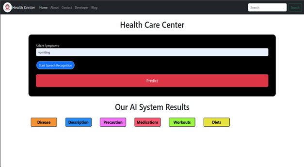

# Medicine-Recommendation-System

# 💊 Medicine Recommendation System – AI-Powered Health Prediction

An AI-based web application that recommends disease-specific medicines, workouts, diets, and precautions based on user symptoms. The system also supports voice input through speech recognition.

---

## 📌 Short Description / Purpose

🔹 The **Medicine Recommendation System** helps users get quick, AI-generated medical guidance by simply entering or speaking their symptoms.  
🔹 It provides predictions for potential diseases along with recommended medications, diets, workouts, precautions, and disease descriptions.  
🔹 This project can serve as a prototype for AI-enabled telehealth systems.

---

## 📊 Features Showcased in the Dashboard

- 🧠 **AI-Based Symptom Analysis**  
- 🎙️ **Speech Recognition Integration**  
- 📝 **Disease Prediction & Medical Guidance**  
- 💊 **Medication Recommendations**  
- 🍽️ **Dietary Suggestions**  
- 🏋️ **Workout Plans**  
- ⚠️ **Precautions and Descriptions**

---

## ⚙️ Tools & Technologies Used

- **Frontend**: HTML, CSS, JavaScript  
- **Backend**: Python (Flask Framework)  
- **Machine Learning**: Scikit-learn, Pandas, NumPy  
- **Speech Recognition**: Web Speech API / Python SpeechRecognition  
- **IDE**: VS Code  
- **Data Source**: Symptom-disease-medicine dataset (CSV)

---

## 🖼️ Snapshot of the Application

---

## 📂 Folders / File Structure (If applicable)

├── app.py
├── templates/
│ └── index.html
├── static/
│ └── styles.css
├── model/
│ └── trained_model.pkl
├── data/
│ └── symptoms_dataset.csv
└── README.md

---

## 🧠 How It Works

1. User types or speaks symptoms into the interface.  
2. The system processes the input using NLP & ML models.  
3. The model predicts the likely disease.  
4. Recommendations for medication, precautions, workouts, and diet are generated.  
5. Results are displayed with a clean and interactive UI.

---

## 🚀 Future Scope

- Integration with real-time medical APIs (e.g., FDA Drug Database)  
- Add multilingual speech support  
- Improve prediction accuracy with deep learning  
- Enable user login and health history tracking

---

## 👨‍⚕️ Disclaimer

> This is a **prototype for educational purposes only**. Always consult a licensed medical professional for any health issues.

---

## 📬 Contact

📧 ayushpatil015@gmail.com  
🌐 [LinkedIn – Ayush Patil](https://www.linkedin.com/in/ayush-patil-2042042b4)

---
